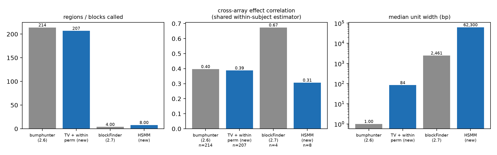

# ewas-crossarray-harmonise

[](https://github.com/kkamieniecka/ewas-crossarray-harmonise/actions/workflows/ci.yml)
[](LICENSE)
[](https://www.nextflow.io/)

Reproducible cross-array harmonisation and region detection for **longitudinal
EWAS** combining Illumina HumanMethylation450 (450K) and MethylationEPIC data.

This extends the EWASGalaxy tool suite (Murat *et al.*, bioRxiv 2019,
doi:10.1101/553784) in two ways:

1. a harmonisation stage that keeps each array in its **native probe space**
   until QC is complete, then merges only through `minfi::combineArrays()`;
2. **replacements for sections 2.6 and 2.7** of Aryee *et al.*
   (*Bioinformatics* 2014;30:1363), whose fixed-gap clustering, fixed-span
   loess smoothing and free permutation are not valid on a harmonised,
   repeated-measures design.

The legacy path is run on the *identical* harmonised matrix, so the change is
measured rather than asserted.

## Documentation

| | |
|---|---|
| [`docs/design-rationale.md`](docs/design-rationale.md) | why the pipeline is shaped this way — the confounding, what is estimable, what harmonisation costs. **Start here.** |
| [`docs/methods.md`](docs/methods.md) | formal methods, written to be usable as a manuscript methods section |
| [`docs/installation.md`](docs/installation.md) | containers, conda, and the Apple Silicon route |
| [`docs/parameters.md`](docs/parameters.md) | every parameter, with the default that actually runs |
| [`docs/results-GSE237561.md`](docs/results-GSE237561.md) | validation run: 126 arrays, 38 subjects, two cohorts across both array generations |
| [`CHANGELOG.md`](CHANGELOG.md) | version history and known limitations |

## The design constraint that drives everything

In a two-cohort 450K + EPIC study, **every Sentrix chip is nested entirely
within one array type**, so array type is perfectly collinear with cohort *and*
with chip. No design matrix can separate them, and adding `Array_Type` as a
covariate produces a rank-deficient design.

What *is* estimable is the **within-subject** change over the exposure: each
subject sits wholly on one array, so a subject intercept absorbs array, cohort
and chip together, exactly, and the exposure coefficient is identified from
repeated visits of the same person. Every downstream stage is built on that
contrast, and three consequences are enforced in code rather than left to the
user — only time-varying covariates are usable, permutation shuffles the
exposure only among visits of the same subject, and cross-validation holds out
whole subjects.

## What harmonisation actually costs

Measured directly from the two GEO platform manifests (`GPL13534`,
`GPL21145`):

| | probes |
|---|---|
| shared by CpG name | 454,181 |
| 450K only | 31,396 |
| EPIC only | 413,745 |

For the 454,181 shared probes, Infinium design type, both probe sequences,
colour channel and hg19 position are **100 % concordant**. Every single
`AddressA_ID` differs, so an address-level join returns nothing — the
intersection must be on CpG name.

**Harmonisation costs probe content, not chemistry.** No shared probe changes
design type, so no type-I/II re-typing correction is required and BMIQ is off
by default rather than mandatory. But the content it costs is not evenly
distributed, and that is what breaks the legacy region and block finders:

* **Spacing.** On the harmonised autosomal set the median inter-probe gap is
  335 bp and only **48.2 %** of neighbouring pairs fall within 300 bp — the
  `clusterMaker` default. A cluster becomes a property of the array panel
  rather than of the locus.
* **Open sea.** **78.2 %** of EPIC-only probes are open sea against **36.4 %**
  of shared probes. Harmonisation discards 323,589 EPIC open-sea probes,
  leaving 162,471 shared autosomal ones — so open sea is the content that
  differs *most* between arrays, and it is exactly what block finding relies
  on.

## What replaces sections 2.6 and 2.7

### §2.6 — bump hunting → `bin/04_dmr_ml.R` (or `.py`)

| minfi 2.6 | why it fails here | replacement |
|---|---|---|
| `clusterMaker(maxGap = 300)` | clusters follow the panel, not the locus (only 48 % of gaps ≤ 300 bp after harmonisation) | probes joined only when **close *and* co-methylated** in within-subject residuals |
| `loessByCluster`, fixed span | a span in *probes* treats a 50 bp and a 50 kb step as equal neighbours; returns a curve with no breakpoints | **weighted total-variation denoising** with an `exp(-d/decay)` fusion penalty — piecewise-constant, so breakpoints are explicit; smoothness by held-out-**subject** CV |
| permute the design column freely | destroys within-subject pairing and, because subject/cohort/chip/array are nested, manufactures between-array contrasts no real reassignment could produce | **within-subject permutation**; the legacy scheme is available via `--also-naive-perm` purely to quantify its mis-calibration |
| a single FWER per region | — | FWER **plus** stability selection over subject subsamples, **plus** cross-array generalisation |

Stage 04 ships in **both R and Python**, with identical flags and proved
equivalent function by function (`tests/test_equivalence.R`: effects agree to
1e-16, identical cluster ids, identical segmentation and region boundaries).
R is the default because the rest of the suite is R; `--dmr_impl python` runs
the other one, which is how the agreement is re-checked on real data. See
docs/design-rationale.md §7 for what the port cost and the three defects it
exposed.

### §2.7 — block finding → `bin/05_blocks_hsmm.py`

| minfi 2.7 | why it fails here | replacement |
|---|---|---|
| `cpgCollapse`, 500 bp gap / 1500 bp width | open sea is the least comparable content across arrays, so fixed-width units depend on which array a sample came from | clusters formed where open-sea probes are close **and** co-methylated, restricted to probes **both** arrays carry |
| `blockFinder`: ≥250 kb loess, threshold the curve | boundaries are resolution-limited (the paper says so) and carry no confidence measure | **3-state distance-aware HMM** (hypo/neutral/hyper) with `A(d) = e^{-d/L} I + (1-e^{-d/L}) 1π'`; emissions carry each cluster's own SE; posterior decoding gives soft boundaries and a per-block posterior |

## Validation run

Full record in [`docs/results-GSE237561.md`](docs/results-GSE237561.md); tables
and logs under [`results/GSE237561/`](results/GSE237561/).



On GSE237561 (126 arrays, 38 subjects, 26 on 450K and 12 on EPIC, no subject
or chip spanning both):

| | bumphunter (2.6) | TV + within-subject perm |
|---|---|---|
| units called | 214 | 207 |
| median width / probes | 1 bp / 1 | 84 bp / 3 |
| cross-array *r* (shared estimator) | 0.397 | 0.388 |
| cross-array sign concordance | 0.729 | **0.821** |

`clusterMaker` at its default returns 220,883 clusters over 422,898 probes —
median one probe per cluster — so more than half of `bumphunter`'s "regions"
are single probes and it is not aggregating at all on this panel. The
replacement attains the same cross-array correlation on 3-probe regions, with
better sign concordance.

Isolating the permutation scheme on the identical observed statistic, the null
95th percentile of max |z| is 5.99 under within-subject permutation and 6.28
under the free bumphunter-style scheme: the legacy scheme is mis-calibrated in
the **conservative** direction here, costing power rather than creating false
positives.

**Two negatives, recorded rather than buried.** No region or block reaches
FWER ≤ 0.05 by any of the four methods, and one probe reaches FDR < 0.05 —
expected with 38 subjects. And cross-validation finds no interior smoothness
optimum on this panel; the region set is invariant across the whole range
tested, so it does not affect the result. Both are written up in §7–8 of the
results document.

## Layout

```
ewas-crossarray-harmonise/
├── main.nf                       Nextflow DSL2 workflow
├── nextflow.config               resources, conda/docker/singularity, test profile
├── bin/
│   ├── 01_harmonise.R            IDAT -> harmonised beta/M (+ float64 export)
│   ├── 02_probe_model.R          repeated-measures probe-level effects
│   ├── 03_baseline_bumphunter.R  LEGACY §2.6/§2.7, same matrix
│   ├── 04_dmr_ml.R               §2.6 replacement (default)
│   ├── 04_dmr_ml.py              §2.6 replacement, Python twin (--dmr_impl python)
│   ├── 05_blocks_hsmm.py         §2.7 replacement
│   ├── 06_compare.py             controlled old-vs-new benchmark
│   ├── ewasml.R                  numerical core, R
│   └── ewasml.py                 numerical core, Python
├── tests/test_ewasml.py          numerical property checks (Python core)
├── tests/test_equivalence.R      R core must reproduce the Python core exactly
├── tests/gen_equivalence_fixtures.py   generates those inputs and references
├── galaxy/                       Galaxy wrappers, shared macros, .shed.yml
├── conf/                         conda specs + source-install script
├── docs/                         methods, rationale, parameters, results
├── results/GSE237561/            validation tables, run records, logs
└── data/sample_sheets/           the validation run's sample sheet
```

## Quickstart

```bash
nextflow run . -profile docker \
    --sheet      data/sample_sheets/sample_sheet_GSE237561.csv \
    --idat_dir   data/idat \
    --probe_map  crossarray_probe_map.csv.gz \
    --exposure   days_on_clozapine \
    --subject    Subject_ID \
    --outdir     results
```

`-profile test` runs the same graph with 10 permutations and no baseline as a
smoke test. Every stage is also runnable standalone as an ordinary
`Rscript`/`python` command with `--help`. See
[`docs/installation.md`](docs/installation.md) for the conda and Apple Silicon
routes, and [`docs/parameters.md`](docs/parameters.md) for the sample-sheet
columns and every parameter.

Raw data are not committed. The validation run uses
[GSE237561](https://www.ncbi.nlm.nih.gov/geo/query/acc.cgi?acc=GSE237561); the
sample sheet in `data/sample_sheets/` maps its GSM accessions to subjects,
visits and array types.

## Tests

```bash
python tests/test_ewasml.py
```

17 property checks on simulated data, each stating the property and its
tolerance so a failure localises to one estimator: recovery of a known effect
under a deliberately huge array offset nested within subject, annihilation of
a time-invariant covariate, variance-moderation shrinkage, TV recovery of a
piecewise-constant track, the flat limit as the penalty grows, structural and
calibration checks on the within-subject permutation, HMM block recall and
state ordering, and co-methylation clustering behaviour.

CI additionally checks Galaxy wrapper XML well-formedness, that every macro
token a tool references is defined, and that all four Nextflow profiles
resolve.

## Citing

If you use this pipeline, cite it via [`CITATION.cff`](CITATION.cff) and cite
the two works it builds on:

* Murat K, Grüning B, Poterlowicz PW, Westgate G, Tobin DJ, Poterlowicz K.
  EWASGalaxy: a tools suite for population epigenetics integrated into Galaxy.
  *bioRxiv* 2019. doi:10.1101/553784
* Aryee MJ, Jaffe AE, Corrada-Bravo H, Ladd-Acosta C, Feinberg AP, Hansen KD,
  Irizarry RA. Minfi: a flexible and comprehensive Bioconductor package for the
  analysis of Infinium DNA methylation microarrays. *Bioinformatics*
  2014;30(10):1363–9. doi:10.1093/bioinformatics/btu049

## License

MIT — see [LICENSE](LICENSE).
